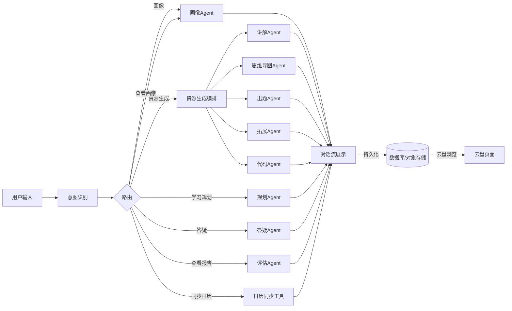

> 将产品需求文档（PRD）中的业务诉求翻译为开发级别的技术需求，供技术负责人和开发者使用。

---

# 1. 文档定位

## 1.1 文档目的

本文档是时纪流（ChronoFlow）**智流（MindFlow）**AI学习模块的需求分析文档，职责是将PRD中的产品需求翻译为开发层面的功能需求和非功能需求。它不描述具体实现方式（那是设计文档的职责），也不重复用户视角的产品需求（那是PRD的职责）。

三层文档关系：
- PRD回答"用户要什么"
- 本文档回答"技术上需要实现什么"
- 设计文档回答"怎么做、代码怎么搭"

## 1.2 系统概述

本项目基于时纪流（ChronoFlow）现有系统迭代开发。时纪流是一个已上线运行的移动端日程管理应用，技术栈为Flutter前端 + Spring Boot后端 + MySQL/Redis/MinIO，已实现个人日程CRUD、图片OCR日程识别、多层级群组协作、意见反馈、管理后台等功能，部署于阿里云ECS。

在时纪流基础上，本次迭代新增**智流（MindFlow）**AI学习模块，基于科大讯飞星火大模型搭建多智能体个性化学习系统。新增模块以统一对话界面为核心交互入口，通过意图识别将用户请求路由至不同Agent（画像、资源生成、规划、答疑、评估），各Agent协同完成个性化学习全流程。生成的资源以云盘形式持久化管理，学习任务可一键同步至系统日历。现有日程、群组、认证等基础功能保持不变，AI模块作为新增能力集成至APP发现页。

## 1.3 PRD到开发需求的映射

- **发现页双卡片入口** → 需要发现页UI组件，包含AI学习系统和云盘两个入口卡片（PRD 3.1）
- **统一对话界面** → 需要对话管理能力：会话创建、消息存储、流式渲染、多轮上下文维护（PRD 3.2）
- **纯自然语言交互** → 需要意图识别机制：将用户输入分类为画像/资源/规划/答疑/评估等意图，路由至对应Agent（PRD 3.2）
- **六维学习画像** → 需要画像构建Agent：多轮问答采集六维数据，生成可视化画像卡片，支持查看和更新（PRD 3.3）
- **多智能体资源生成** → 需要资源生成编排：多个子Agent（讲解/思维导图/出题/拓展/代码）协同生成5类资源（PRD 3.4）
- **AI学习规划** → 需要规划Agent：结合画像和知识点依赖生成阶梯式学习路径（PRD 3.5）
- **多模态答疑** → 需要答疑Agent：分步文字解析+可视化图解生成（PRD 3.6）
- **学习效果评估** → 需要行为采集+评估Agent：记录学习行为，周期性生成分析报告（PRD 3.7）
- **云盘资源管理** → 需要资源存储与目录展示：按类型分文件夹，标准目录形式浏览（PRD 3.8）
- **学习任务同步日历** → 需要日历同步工具：将AI生成的任务转化为标准日程写入日历（PRD 3.5）
- **使用指导** → 静态说明页面，对话界面入口（PRD 3.2）
- **防幻觉与内容安全** → 需要内容审核机制：基于知识库的事实校验、敏感内容过滤（PRD 4.2, 4.4）
- **流式输出** → 需要SSE流式响应链路：星火API → 后端 → Flutter端实时渲染（PRD 4.2）

# 2. 功能需求

每个功能需求描述系统必须完成的开发级要求，不涉及具体实现方式。

## 2.1 发现页

**FR-01 发现页入口展示**
- 输入：底部导航【发现】tab切换
- 输出：两个卡片入口（AI学习系统、我的云盘）
- 约束：页面仅包含两个卡片，无其他内容

**FR-02 AI学习系统入口点击**
- 输入：用户点击卡片
- 输出：跳转至统一对话界面
- 约束：新建会话或恢复最近会话

**FR-03 云盘入口点击**
- 输入：用户点击卡片
- 输出：跳转至云盘页面
- 约束：展示当前用户已生成的全部资源

## 2.2 对话管理

**FR-04 会话创建**
- 输入：用户进入对话界面
- 输出：新建会话，生成会话ID
- 约束：每次进入新建独立会话

**FR-05 消息存储**
- 输入：用户消息 + AI回复
- 输出：持久化至数据库
- 约束：按会话ID组织，支持历史查询

**FR-06 流式输出**
- 输入：星火API流式响应
- 输出：Flutter端逐字渲染
- 约束：通过SSE透传，无长时间白屏

**FR-07 多轮上下文维护**
- 输入：对话历史
- 输出：当前会话上下文
- 约束：上下文超长时自动摘要或截断

**FR-08 使用指导入口**
- 输入：用户点击对话界面小图标
- 输出：展示静态使用说明页面
- 约束：说明各功能使用方法和示例指令

## 2.3 意图识别与路由

**FR-09 意图分类**
- 输入：用户自然语言输入
- 输出：意图标签（画像/资源/规划/答疑/评估/日历同步/查看画像/查看报告/通用对话）
- 约束：结合当前对话上下文判断，非单句判断

**FR-10 Agent路由**
- 输入：意图标签
- 输出：调用对应Agent执行
- 约束：路由失败时回退到通用对话

## 2.4 六维学习画像

**FR-11 画像构建对话**
- 输入：用户触发"开始学情测评"
- 输出：多轮问答引导采集六维数据
- 约束：六维指标——知识基础、认知风格、学习节奏、薄弱知识点、学习目标、易错类型

**FR-12 画像生成**
- 输入：六维问答数据
- 输出：可视化画像卡片
- 约束：采集完整率≥95%，无缺失维度

**FR-13 画像查看**
- 输入：用户输入"查看画像"
- 输出：当前画像卡片展示
- 约束：无画像时提示先进行测评

**FR-14 画像更新**
- 输入：用户输入"更新画像"
- 输出：重新进入画像构建对话
- 约束：覆盖旧画像，保留历史版本

## 2.5 多智能体资源生成

**FR-15 资源生成意图识别**
- 输入：用户描述知识点/需求
- 输出：资源生成请求 + 知识点提取
- 约束：支持模糊描述，系统自动细化

**FR-16 多Agent协同编排**
- 输入：知识点 + 用户画像
- 输出：5类资源（讲解文档、思维导图、习题、拓展材料、代码案例）
- 约束：各子Agent独立生成，支持并行

**FR-17 资源流式输出**
- 输入：各Agent生成结果
- 输出：对话流中逐类展示
- 约束：生成成功率≥90%

**FR-18 资源存储**
- 输入：生成的资源内容
- 输出：持久化至数据库和对象存储
- 约束：按资源类型分类存储

**FR-19 个性化适配**
- 输入：用户画像 + 资源内容
- 输出：适配用户知识基础的资源
- 约束：非千人一面，根据画像调整难度和深度

## 2.6 AI智能学习规划

**FR-20 规划意图识别**
- 输入：用户描述目标和时长
- 输出：学习目标、时间范围、每日时长
- 约束：支持自然语言描述，自动提取结构化参数

**FR-21 学习路径生成**
- 输入：目标 + 画像 + 知识点依赖
- 输出：阶梯式学习路线 + 每日任务清单
- 约束：路径适配准确率≥85%

**FR-22 计划展示**
- 输入：生成的学习计划
- 输出：对话流中展示计划详情
- 约束：支持刷新重新生成

## 2.7 多模态智能答疑

**FR-23 答疑意图识别**
- 输入：用户提问
- 输出：答疑请求 + 问题提取
- 约束：支持追问上下文关联

**FR-24 分步解析生成**
- 输入：问题 + 知识库检索结果
- 输出：分步文字解析
- 约束：答疑有效解决率≥90%

**FR-25 可视化图解生成**
- 输入：复杂知识点
- 输出：流程图/时序图等图解
- 约束：自动判断是否需要图解

**FR-26 追问支持**
- 输入：用户追问
- 输出：基于上下文的深入解答
- 约束：保持答疑上下文连贯

## 2.8 学习效果评估

**FR-27 学习行为采集**
- 输入：用户操作（资源查看、习题练习、答疑互动）
- 输出：行为记录持久化
- 约束：实时采集，全量记录

**FR-28 报告生成**
- 输入：行为数据 + 画像
- 输出：学习分析报告（知识掌握度、薄弱点、学习效率）
- 约束：周期性自动生成

**FR-29 报告查看**
- 输入：用户输入"查看学习报告"
- 输出：最新报告展示
- 约束：无数据时提示暂无报告

**FR-30 计划自适应调整**
- 输入：评估结果
- 输出：调整后续资源难度和学习计划
- 约束：自动下调/上调难度

## 2.9 云盘资源管理

**FR-31 资源目录展示**
- 输入：用户进入云盘页面
- 输出：5个文件夹（讲解文档、思维导图、练习题、拓展材料、代码案例）
- 约束：标准文件目录形式

**FR-32 资源列表查看**
- 输入：用户点击文件夹
- 输出：该类型下所有资源列表
- 约束：按生成时间排序

**FR-33 资源详情查看**
- 输入：用户点击资源
- 输出：资源内容展示
- 约束：支持图文内容渲染

## 2.10 学习任务日历同步

**FR-34 日历同步指令识别**
- 输入：用户输入"同步到日历"
- 输出：同步请求
- 约束：结合上下文确定同步哪些任务

**FR-35 任务转日程**
- 输入：AI学习任务列表
- 输出：标准日程写入系统日历
- 约束：转化为系统日程格式，支持查看编辑

**FR-36 同步结果反馈**
- 输入：同步操作结果
- 输出：对话流中返回同步结果
- 约束：成功/失败均反馈

## 2.11 知识库

**FR-37 知识库构建**
- 输入：课程文档集
- 输出：向量化知识库
- 约束：至少一门完整高校专业课程

**FR-38 知识检索**
- 输入：查询文本
- 输出：相关知识片段
- 约束：语义检索 + 关键词检索混合

# 3. 非功能需求

## 3.1 性能

- **NFR-01 AI流式输出延迟**：首token响应时间≤3秒
- **NFR-02 资源生成端到端时间**：单类资源生成≤30秒，5类资源完整生成≤3分钟
- **NFR-03 画像生成时间**：完整六维画像构建≤2分钟
- **NFR-04 云盘页面加载**：资源列表加载≤2秒
- **NFR-05 日历同步响应**：同步操作≤3秒

## 3.2 兼容性

- **NFR-06** Android 8.0及以上版本正常运行
- **NFR-07** 讯飞星火API OpenAI兼容端点正常对接
- **NFR-08** 中文输入与输出，中文内容渲染正确
- **NFR-09** 现有日程、群组、认证功能不受影响

## 3.3 可用性

- **NFR-10** 意图识别准确率≥90%，误路由时有兜底通用对话
- **NFR-11** 对话界面提供使用指导，新用户可独立完成首次使用
- **NFR-12** AI回复支持Markdown渲染，图文混排展示清晰
- **NFR-13** 流式输出过程可中断，用户可随时发送新消息

## 3.4 安全性

- **NFR-14** 内置防幻觉机制，基于知识库校验AI生成内容的事实准确性
- **NFR-15** 内容安全审核，过滤敏感、违规学术内容
- **NFR-16** 用户画像、学习记录、对话历史全程加密存储
- **NFR-17** AI生成内容仅用于个人学习，不支持商用导出

# 4. 角色与职责

- **意图路由Agent**：用户输入意图分类，路由至对应Agent，系统入口
- **画像Agent**：六维数据采集、画像生成与更新，多轮对话引导用户完成测评
- **资源生成编排**：协调5个子Agent并行生成资源（讲解/思维导图/出题/拓展/代码）
- **规划Agent**：学习路径规划，结合画像和知识点依赖生成阶梯式学习方案
- **答疑Agent**：问题解析、分步解答、图解生成，结合知识库RAG检索
- **评估Agent**：学习行为分析，报告生成，周期性触发或用户指令触发
- **日历同步工具**：学习任务转化为系统日程，Agent可调用的工具
- **知识检索工具**：向量数据库语义检索，Agent可调用的工具
- **后端服务层**：会话管理、消息存储、资源持久化、用户状态
- **Flutter前端**：对话渲染、流式展示、云盘浏览、发现页
- **用户**：对话交互、内容审阅、指令触发，所有功能通过自然语言驱动

**关键原则**：需要理解和判断的交给Agent（意图识别、内容生成、规划决策），确定性的交给工具和后端（日历同步、数据存储、资源检索）。

# 5. 约束与边界

## 5.1 技术约束

- **AI能力依赖星火API**：所有AI推理通过讯飞星火云端API，无本地大模型能力
- **联网要求**：AI功能必须联网，离线仅可查看已缓存的云盘资源和历史对话
- **知识库范围**：仅覆盖计算机/人工智能类课程，不扩展至其他专业领域
- **资源类型固定**：仅生成5类资源（文档、思维导图、习题、拓展、代码），不生成视频/动画
- **对话为唯一交互入口**：所有AI功能通过统一对话界面完成，无独立功能页面
- **现有系统兼容**：新增AI模块不得破坏现有日程、群组、认证功能

## 5.2 范围边界

**范围内**：
- 发现页双卡片入口（AI学习系统 + 我的云盘）
- 统一对话界面承载全部AI学习功能
- 六维学习画像（对话式构建与更新）
- 多智能体资源生成（5类资源，流式输出）
- AI智能学习规划（一键同步日历）
- 多模态智能答疑（文字+图解）
- 学习效果评估与报告
- 云盘资源管理（按类型文件夹浏览）
- 基础日程协作（已有功能，适配即可）
- 使用指导页面

**范围外**：
- iOS/Web/小程序多端适配
- 完整视频/动画多模态资源
- 第三方日程工具导入导出
- 学习社区、社交互动功能
- 付费、会员、商业化体系
- 多语种翻译
- 非计算机/AI类课程内容
- 实时直播授课、在线考试
- 智能硬件联动

# 6. 关键风险

- **星火API响应延迟或不可用** → 降级策略：提示用户稍后重试；核心日程功能不受影响
- **意图识别误分类** → 兜底通用对话；用户可重新表述；提供使用指导引导正确指令
- **AI幻觉生成错误知识内容** → 基于知识库RAG校验；内容安全审核；明确标注AI生成内容
- **多Agent协同资源生成耗时长** → 流式输出逐类展示，避免长时间白屏；进度提示
- **对话上下文超长导致截断** → 自动摘要机制；关键信息（画像、计划）独立存储不依赖对话历史
- **向量数据库在现有服务器资源不足** → 评估轻量方案（Pgvector）；必要时升级服务器配置
- **带宽不足影响流式输出体验** → 评估现有~1Mbps带宽是否满足；必要时升级
- **知识库内容质量影响答疑效果** → 初始知识库人工审核；建立内容更新和纠错机制

# 7. 分期规划

**P0 — 首期交付**：
- 发现页双卡片入口
- 统一对话界面（会话管理 + 流式输出）
- 意图识别与路由
- 六维学习画像（构建 + 查看 + 更新）
- 多智能体资源生成（5类资源）
- 我的云盘
- 使用指导页面
- 知识库构建与检索

**P1 — 后续迭代**：
- AI智能学习规划（含一键同步日历）
- 多模态智能答疑（文字+图解）
- 学习效果评估与报告
- 学习任务日历同步
- 画像动态更新（基于行为自动迭代）
- 资源难度自适应调整

---

> 详细的模块实现设计、技术选型、数据库设计、API设计、多智能体框架架构、部署方案等内容见技术设计文档。
